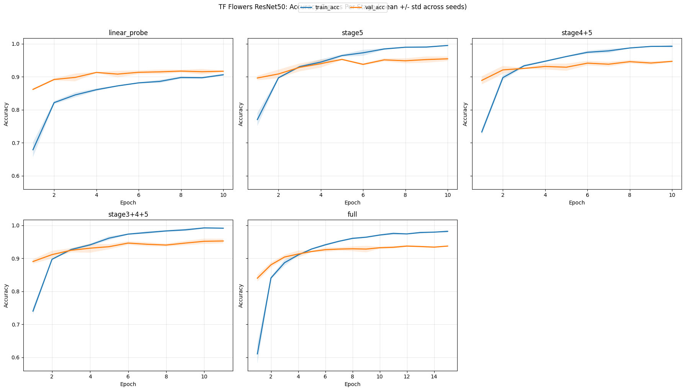
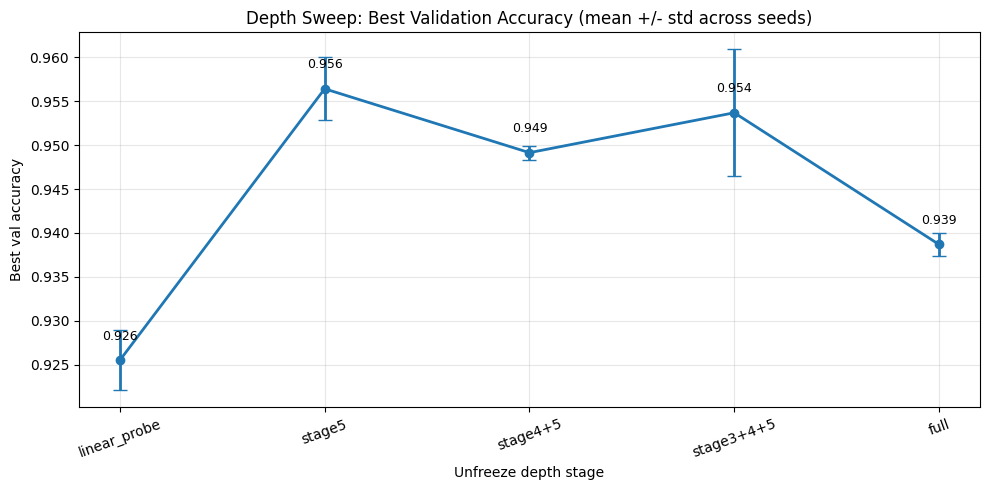

# flower-classification-transfer-learning

How does fine-tuning depth interact with training duration in transfer learning for small datasets?

## Dataset

Experiments are conducted on the **TF Flowers** dataset, a small image classification benchmark containing five flower categories.  
Due to the limited dataset size, transfer learning from a pretrained backbone is required to achieve good performance.

## Model

We use a **ResNet50** model pretrained on ImageNet as the backbone.

The classification head is replaced with a new fully connected layer for the 5 flower classes.

## Fine-tuning Strategy

To study the effect of fine-tuning depth, we progressively unfreeze deeper layers of the network:

| Configuration | Trainable Layers |
|---|---|
| Linear Probe | classifier only |
| Stage5 | last ResNet block |
| Stage4+5 | last two blocks |
| Stage3+4+5 | last three blocks |
| Full | entire network |

All models are trained for the same number of epochs with identical optimization settings.

## Results

Validation performance varies depending on the depth of fine-tuning.

| Configuration | Best Validation Accuracy |
| --- | --- |
| Linear Probe | ~0.93 |
| Stage5 | **~0.96** |
| Stage4+5 | ~0.95 |
| Stage3+4+5 | ~0.95 |
| Full Fine-tuning | ~0.94 |

The results show a non-monotonic relationship between fine-tuning depth and performance.

For reference, the training and validation learning curves for each configuration are shown below.

## Conclusion

On the TF Flowers dataset, fine-tuning only the final ResNet50 stage (stage5) achieved the highest validation accuracy.  
Keeping the backbone fully frozen led to underfitting, while unfreezing deeper layers did not improve performance and sometimes slightly reduced it.

These results suggest that, for small datasets, shallow fine-tuning of the final convolutional block provides the best balance between feature adaptation and overfitting.
